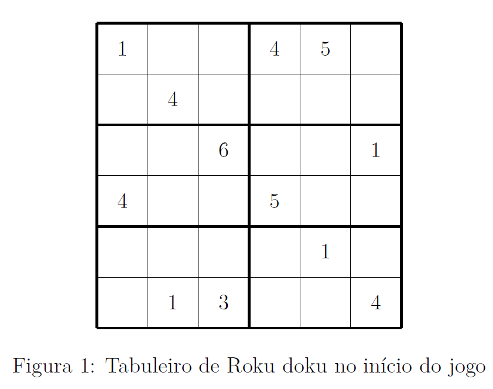
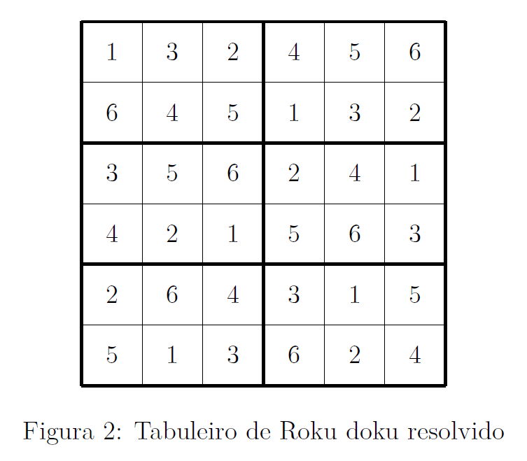

# Roku doku
Roku doku é uma variante do conhecido jogo de Sudoku. A principal diferença está em relação ao número de algarismos utilizados: no Sudoku tradicional, o jogador deve escrever todos os números de 1 a 9, enquanto no Roku doku são utilizados apenas números de 1 a 6. A outra diferença significativa é que no jogo de Sudoku o jogador preenche 9 quadrados, de dimensão 3 por 3 cada, mas no Roku doku são utilizados 6 retângulos, de 2 linhas e 3 colunas cada. Um diagrama de Roku doku é apresentado como exemplo a seguir:

As regras para o preenchimento do tabuleiro são as seguintes:

1. Cada linha deve conter os algarismos de 1 a 6, sem repetição.  

2. Cada coluna deve conter os algarismos de 1 a 6, sem repetição.  

3. Cada retângulo 3 x 2 (indicado pelas linhas mais grossas na Figura 1 ) deve conter os algarismos de 1 a 6, sem repetição.  

De acordo com essas regras, a solução do tabuleiro anterior é:

Você deve escrever um programa que permita ao usuário jogar uma partida de Roku doku.  

Utilize como tabuleiro inicial o diagrama da Figura 1. Inicialmente, o seu programa deve imprimir na tela o tabuleiro original e pedir para o usuário colocar um número. Isso é feito a partir de três dados de entrada: o valor da linha, o valor da coluna e o valor do algarismo em si que deve ser colocado.

Será utilizada como convenção de numeração a regra habitual de matrizes na matemática: o elemento na primeira linha, no canto superior esquerdo, é o da posição linha = 1, coluna = 1. Os números das linhas aumentam de cima para baixo e os das colunas da esquerda para a direita.  

O seu programa deve então verificar se o número que o usuário deseja inserir é possível ou não, de acordo com as três regras descritas anteriormente e também avaliando se a casa em questão já está preenchida ou não.

Caso o usuário digite uma entrada inválida, é necessário pedir para que ele insira novamente as três informações (linha, coluna e posição). 

Caso o usuário digite uma entrada válida, o seu programa imprime o tabuleiro atualizado na tela e pede para ele inserir o próximo número, seguindo as mesmas regras. 

O seu programa deve continuar até que todas as casas do tabuleiro tenham sido preenchidas adequadamente.